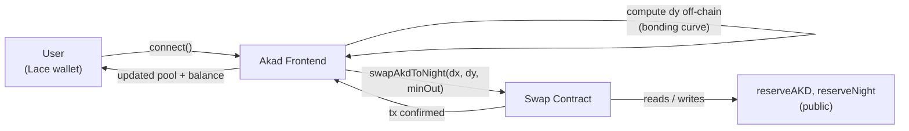
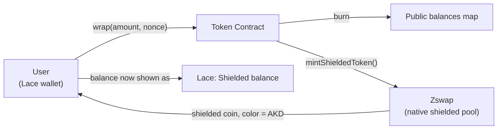

# Akad

-blue)

Privacy-optional AMM on Midnight Network, built for Rise In × Midnight "New Moon to Full: Monthly Moonshots"

[Live Demo](https://akad-dzakwannajmis-projects.vercel.app) · [See Full Proposal](docs/PROPOSAL.md) · [Troubleshooting & Build Notes](docs/TROUBLESHOOTING.md) · [Demo Video](https://youtu.be/UO1GlUcs83A?si=Dy7LKhTyzAB2-3Aj)

---

## Table of Contents

- [What is Akad](#what-is-akad)
- [Live Demo & Deployed Contracts](#live-demo--deployed-contracts)
- [Trying the App](#trying-the-app)
- [Architecture](#architecture)
- [Design Notes](#design-notes)
- [End-to-End Flows](#end-to-end-flows)
- [Privacy Model](#privacy-model)
- [Roadmap](#roadmap)
- [Testing & CI](#testing--ci)
- [Running Locally](#running-locally)
- [Project Structure](#project-structure)

## What is Akad

Akad is a constant-product AMM (`x * y = k`) for swapping a custom fungible token (AKD) against tNIGHT on Midnight Network. Users can hold AKD publicly (standard token balance) or convert it into a genuinely private, unlinkable balance backed by Midnight's native Zswap shielded-coin infrastructure.

The idea behind the name: "Akad" is an agreement between two parties — every swap is exactly that, with a level of openness each trader chooses for themselves.

## Live Demo & Deployed Contracts

**App:** https://akad-dzakwannajmis-projects.vercel.app/

**Network:** Midnight Preview testnet

**Contracts:**

| Contract | Address |
|---|---|
| Token (AKD) | `e62f476dc4194c4ea3641016f55f4eb7069ab2ead2903deb3fdfe4f5f9f63d04` |
| Swap (AMM) | `c4831f264adc54f237823ad837733c8ccbc698218f64cf3f13e84c02b8b8b5bb` |

[View swap contract on Night Scan](https://explorer.preview.midnight.network/contracts/stream/c4831f264adc54f237823ad837733c8ccbc698218f64cf3f13e84c02b8b8b5bb) · [View on Midnight Explorer](https://preview.midnightexplorer.com/contracts/0xc4831f264adc54f237823ad837733c8ccbc698218f64cf3f13e84c02b8b8b5bb)

## Trying the App

1. Install [Lace wallet](https://www.lace.io/midnight) and switch its network to **Preview**.
2. Get test tokens from the [Preview faucet](https://faucet.preview.midnight.network/) (you'll need tNIGHT for gas, and generate tDUST from it in Lace).
3. Open the [live demo](https://akad-dzakwannajmis-projects.vercel.app/) and click **Launch App**.
4. Connect your wallet on the swap page.
5. Enter an amount, review the quote, and swap.
6. Try **Wrap to Private** below the swap card — enter an AKD amount, wrap it, then check Lace: your shielded AKD balance appears automatically, unlinked from your public balance.

## Architecture

    contracts/    Compact smart contracts (token, swap) — see contracts/README.md
    frontend/     Next.js app (landing, swap UI, wallet integration) — see frontend/README.md
    docs/         Build notes and troubleshooting log

**Stack:** Compact (smart contracts) · Next.js + TypeScript (frontend) · Lace wallet via DApp Connector API v4 · shadcn/ui · Vitest · GitHub Actions.

## Design Notes

Akad's swap mechanics use a standard constant-product model — public reserves, `x * y = k`, no oracle dependency. This part is deliberately conventional: it's a well-understood, battle-tested AMM design, and reinventing pricing mechanics wasn't the point of this project.

The part that isn't standard is the privacy layer sitting alongside it. Rather than treating privacy as a separate product, Akad treats it as a mode a user opts into for their own holdings — public AKD behaves exactly like a normal ERC20-style balance, and `wrap` converts it into a native Zswap shielded coin whenever a user wants that balance to stop being publicly linkable. The AMM itself stays fully public (reserves have to be, for price discovery to work at all); the privacy boundary is drawn around token *custody*, not around the trade mechanism. See [Privacy Model](#privacy-model) for exactly what that boundary does and doesn't cover.

## End-to-End Flows

### Public Swap

### Wrap — Public AKD to Private Shielded AKD

`unwrap` (reversing the above) is implemented in the contract but not yet fully working end-to-end from the frontend — see [Roadmap](#roadmap) and [Troubleshooting](docs/TROUBLESHOOTING.md).

## Privacy Model

What an observer **can** learn from the public contract state:

- Pool reserves at any point in time, and every individual swap's size and direction (reserve deltas are public — required for AMM price discovery, true of any chain).
- Public AKD balances, keyed by a hashed (not plaintext) wallet identifier.

What an observer **cannot** learn:

- Slippage tolerance (`minOut`) — used only in an on-chain assertion, never written to public state. A value proven correct without ever being shown.
- **Ownership of any AKD balance moved into shielded form via `wrap`.** Once wrapped, that AKD is a native Zswap shielded coin — unlinkable from the public balance it came from, using Midnight's own audited shielded-pool cryptography rather than a hand-rolled scheme.

The honest boundary: swap trade amounts remain public (structural to any public-reserve AMM); balance ownership is private once wrapped. Akad does not claim trade-amount privacy during a swap.

## Roadmap

- [ ] Fix `unwrap` — requires building the shielded transfer via the wallet's `makeTransfer`/`makeIntent` API rather than relying on automatic transaction balancing (see [Troubleshooting](docs/TROUBLESHOOTING.md))
- [ ] Private swap — spend a shielded AKD coin directly into a swap, rather than wrap → public swap → wrap
- [ ] Multi-token support — pools beyond AKD/tNIGHT
- [ ] Multi-wallet support — beyond Lace (e.g. 1AM)
- [ ] Multi-chain — beyond Midnight
- [ ] Mobile-responsive UI
- [ ] Multi-provider liquidity (LP tokens) — currently a single fixed liquidity seed from the builder
- [ ] Reserve-delta privacy research — batching or delayed settlement to reduce what's inferable from public reserve changes

## Testing & CI

8+ tests (Vitest) covering bonding curve math and wallet compatibility filtering — see `frontend/lib/__tests__/`.

GitHub Actions runs typecheck, tests, and build on every push — see `.github/workflows/ci.yml`.

## Running Locally

Contracts:

    cd contracts
    compact compile src/token.compact ../build/token
    compact compile src/swap.compact ../build/swap

Frontend:

    cd frontend
    npm install
    cp .env.example .env.local
    npm run dev

Full details, including artifact wiring and environment variables, in [contracts/README.md](contracts/README.md) and [frontend/README.md](frontend/README.md).

## Project Structure

See [Architecture](#architecture) above, or the per-folder READMEs for details.
