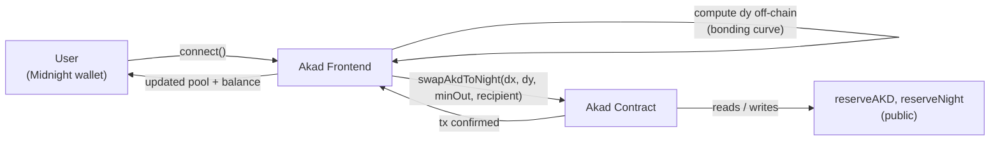
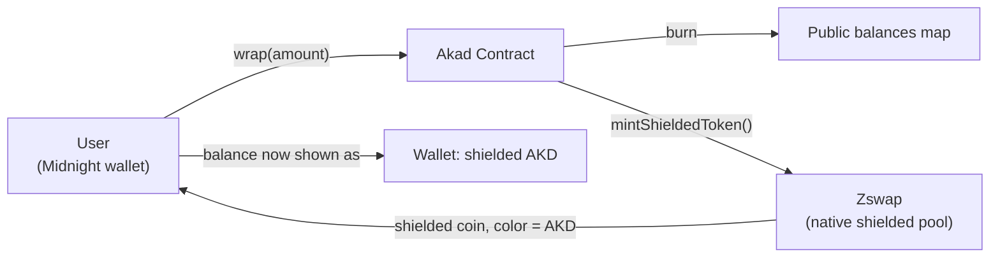
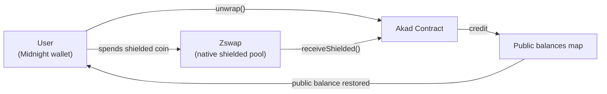
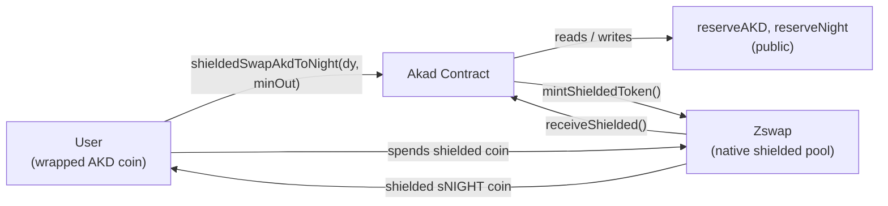
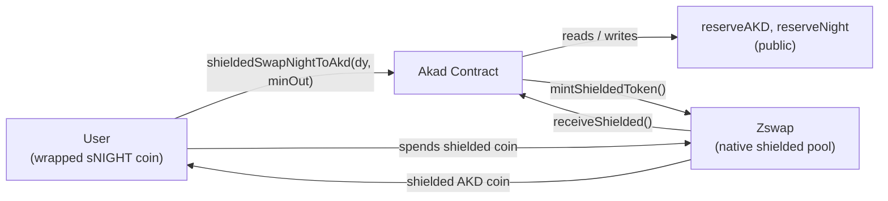

# Akad


[](https://github.com/dzakwannajmi/akad/actions/workflows/ci.yml)
[](LICENSE)
[](https://x.com/akadtok)

Privacy-optional AMM on Midnight Network.

[Live Demo](https://akad-dzakwannajmis-projects.vercel.app) · [Demo Video](https://youtu.be/Va0iGdtlR7s) · [@akadtok](https://x.com/akadtok) · [Troubleshooting & Build Notes](docs/TROUBLESHOOTING.md)

> **Reviewing the contract?** Everything you need is in [`docs/hackathon/`](docs/hackathon/), written for someone seeing the project for the first time: [ARCHITECTURE.md](docs/hackathon/ARCHITECTURE.md) for the contract, [MIDNIGHT_IMPLEMENTATION.md](docs/hackathon/MIDNIGHT_IMPLEMENTATION.md) for exactly what is proven, disclosed, and kept private, [SECURITY_AUDIT.md](docs/hackathon/SECURITY_AUDIT.md) for an independent adversarial audit of an earlier version of this contract (findings and all), and [HOW_TO_RUN.md](docs/hackathon/HOW_TO_RUN.md) to compile it yourself in about five minutes.

---

## Table of Contents

- [What is Akad](#what-is-akad)
- [Live Demo & Deployed Contracts](#live-demo--deployed-contracts)
- [Trying the App](#trying-the-app)
- [Network Toggle](#network-toggle)
- [Architecture](#architecture)
- [Design Notes](#design-notes)
- [End-to-End Flows](#end-to-end-flows)
- [Privacy Model](#privacy-model)
- [Roadmap](#roadmap)
- [Testing & CI](#testing--ci)
- [Running Locally](#running-locally)
- [Project Structure](#project-structure)
- [License](#license)

## What is Akad

Akad is a constant-product AMM (`x * y = k`) for swapping a custom fungible token (AKD) against NIGHT on Midnight Network. Users can hold AKD publicly (standard token balance) or convert it into a shielded balance backed by Midnight's native Zswap infrastructure, which removes the public ledger row tying that holding to their wallet. See [Privacy Model](#privacy-model) for exactly what that does and does not hide.

The idea behind the name: "Akad" is an agreement between two parties. Every swap is exactly that, with a level of openness each trader chooses for themselves.

## Live Demo & Deployed Contracts

**App:** <https://akad-dzakwannajmis-projects.vercel.app/>

**Network:** Midnight Preview testnet (default), with **Preprod** also live and verified. See [Network Toggle](#network-toggle) below.

**Contracts:** shielded AKD/sNIGHT pair build (constructor replacing `init()`, real tNIGHT settlement on the public swap path, `recordTokenColor()`, shielded swaps trading AKD against sNIGHT instead of exposing an unshielded NIGHT address).

| Contract | Network | Address |
| --- | --- | --- |
| Akad (token + AMM) | Preview | `676fb20d4062e293d6521bd8e70af202345f75406ba4922d66453148a9d636ae` |
| Akad (token + AMM) | Preprod | `2689c5c24d4f560ec4ce0be14641ad544bca382d524ebdcb2e69c152f179a51a` |

[View the Preview contract on Night Scan](https://explorer.preview.midnight.network/contracts/stream/676fb20d4062e293d6521bd8e70af202345f75406ba4922d66453148a9d636ae)

Token and swap logic were originally two separate contracts, merged into one so swap circuits could move a trader's real AKD balance without relying on an unverified cross-contract authorization pattern. See [contracts/README.md](contracts/README.md) for why. Coins wrapped against an older deployment cannot be unwrapped against this one: every contract change regenerates the verifier key and the shielded token colour.

## Verified transactions

Every transaction against the two current contracts, as the public Midnight indexer reported them on 25 Sep 2026. Each one has status `SUCCESS` and no failed segment. **Check these on the explorer rather than taking the table's word for it**, and look at three fields: `STATUS`, `EXECUTION SEGMENTS` (any `FAILED` segment means the effects were rolled back) and `SPENT INPUTS` (an unshielded token movement showing zero spent inputs never moved anything).

The last column counts the transaction's unshielded inputs and outputs, the part of a transaction that names an address. The shielded swaps show `0 / 0` on every run: no address appears in them at all.

### Preprod

`2689c5c2…f179a51a`: deploy and 24 circuit calls between 14 and 18 Sep 2026, covering 10 of the 11 circuits. `claimFaucet()` has not run on this deployment.

| Action | Runs | First run | Unshielded inputs / outputs |
| --- | --- | --- | --- |
| deploy | 1 | [`f4414b14…427bc0`](https://explorer.1am.xyz/tx/f4414b146bae054225dde4cef1f37915fb26bc635599fb555ea107d536427bc0?network=preprod) | 0 / 0 |
| `recordTokenColor()` | 1 | [`853ccf42…844d96`](https://explorer.1am.xyz/tx/853ccf42fcbb3ec3dd14d73dd795f3f56d4da7b5be72c6e32435f9b5a6844d96?network=preprod) | 0 / 0 |
| `addLiquidity()` | 1 | [`5113e29d…d4094d`](https://explorer.1am.xyz/tx/5113e29d16e3b60c61c05b12de7b74ea194c87524f2eb6e0318b39a553d4094d?network=preprod) | 1 / 1 |
| `transfer()` | 1 | [`67888cf7…e86fd9`](https://explorer.1am.xyz/tx/67888cf7258032be0bcaadb2584bde8ae1ecb9f627c101bd34fba7e927e86fd9?network=preprod) | 0 / 0 |
| `wrap()` | 5 | [`884a3dbf…6383fb`](https://explorer.1am.xyz/tx/884a3dbf1336f34e7eb531e467fa3ba6bd4756848dd8d40994f57bb70b6383fb?network=preprod) | 0 / 0 |
| `unwrap()` | 2 | [`22d9c167…491a3c`](https://explorer.1am.xyz/tx/22d9c167993da3cd5a538a377f63505f2ac24c7314f90ebbafa6745fa6491a3c?network=preprod) | 0 / 0 |
| `swapAkdToNight()` | 3 | [`1db59292…de4ec7`](https://explorer.1am.xyz/tx/1db592929a8762836656d7de4eb603e539e8e1c54818a63fd444626dcbde4ec7?network=preprod) | 0 / 1 |
| `swapNightToAkd()` | 3 | [`272d0be6…43bbb4`](https://explorer.1am.xyz/tx/272d0be65f1ef2b9a2f1f88d27cb7d9f8f47549122a53e43b2d30be13f43bbb4?network=preprod) | 1 / 1 |
| `shieldedSwapAkdToNight()` | 4 | [`9b327947…25f3de`](https://explorer.1am.xyz/tx/9b3279472c483cc84381f357455bd4acbd7ad33235b271def35d515da025f3de?network=preprod) | 0 / 0 |
| `shieldedSwapNightToAkd()` | 1 | [`db36fb34…60de7f`](https://explorer.1am.xyz/tx/db36fb3411411f3265c66e844c8f1935b928a45cd332568342a4070d6f60de7f?network=preprod) | 0 / 0 |
| `unwrapNight()` | 3 | [`1f502679…12cc41`](https://explorer.1am.xyz/tx/1f50267947ee63e9d0cc54866238402c585731142b499a7521c51778cd12cc41?network=preprod) | 0 / 1 |

### Preview

`676fb20d…9d636ae`: deploy and 7 circuit calls on 18 Sep 2026. `transfer()`, `claimFaucet()`, `unwrap()` and `shieldedSwapNightToAkd()` have not run on this deployment.

| Action | Runs | First run | Unshielded inputs / outputs |
| --- | --- | --- | --- |
| deploy | 1 | [`3b6a1cfa…7ed48e`](https://explorer.1am.xyz/tx/3b6a1cfa7d657c99256afc10fe380016f533b35cd050f0472ac723513b7ed48e?network=preview) | 0 / 0 |
| `recordTokenColor()` | 1 | [`c66ff06d…a5be35`](https://explorer.1am.xyz/tx/c66ff06d30c3cad2f0e0f004a36c3b35e07f6761b0c41ac753c081f30aa5be35?network=preview) | 0 / 0 |
| `addLiquidity()` | 1 | [`ab7587d4…b80d84`](https://explorer.1am.xyz/tx/ab7587d4b30cddbe616ffe5a87a673e9de12561e0a9c703849a269dc88b80d84?network=preview) | 1 / 1 |
| `wrap()` | 1 | [`ac05afa1…182b8d`](https://explorer.1am.xyz/tx/ac05afa1c13464a4d0f8c6d1216e17d20a2960aade244cb29aedb67e47182b8d?network=preview) | 0 / 0 |
| `swapAkdToNight()` | 1 | [`3fa0ab6e…e50dfc`](https://explorer.1am.xyz/tx/3fa0ab6e48912cb650e1a4565c5c6d7d8d7119a8a6589ae05bafe995d7e50dfc?network=preview) | 0 / 1 |
| `swapNightToAkd()` | 1 | [`5f31cde1…393cc6`](https://explorer.1am.xyz/tx/5f31cde163f0c6450cc74cb807b596eee93bd88f9f70cff1f240057b49393cc6?network=preview) | 1 / 1 |
| `shieldedSwapAkdToNight()` | 1 | [`6cc7075a…f25428`](https://explorer.1am.xyz/tx/6cc7075a14cd473c5c88b4afad21ce4f2b5e756f149ec6babd39af0587f25428?network=preview) | 0 / 0 |
| `unwrapNight()` | 1 | [`5d1bb0d5…c8bcfb`](https://explorer.1am.xyz/tx/5d1bb0d53686d1f1fe9170fef8f027530d26b2b65aca037a171a0726c8c8bcfb?network=preview) | 0 / 1 |

Earlier deployments are superseded and their hashes no longer describe this code. They are omitted rather than listed, since a hash that proves nothing about the current contract is worse than no hash at all.

## Trying the App

1. Install a Midnight wallet, **1AM** (recommended) or [Lace](https://www.lace.io/midnight), and switch its network to **Preview**.
2. Get test tokens from the [Preview faucet](https://faucet.preview.midnight.network/): NIGHT for gas, and DUST generated from it.
3. Open the [live demo](https://akad-dzakwannajmis-projects.vercel.app/) and click **Launch App**.
4. Connect your wallet on the swap page.
5. Enter an amount, review the quote, and swap.
6. Try **Wrap to Private** below the swap card. Wrap an AKD amount, then check your wallet: the shielded AKD appears as a native shielded token, unlinked from your public balance.
7. Unwrap sends it back the other way, crediting your public balance again.
8. Once you have a wrapped coin, flip **Private** in the swap card's settings to spend or receive the AKD leg directly as a shielded coin, skipping the wrap/unwrap round trip. See [Design Notes](#design-notes) for exactly what that hides and what it doesn't.

> **Wallet note:** `unwrap()` is verified on 1AM. On Lace, the shielded-receive transaction hangs inside the wallet's own `balanceUnsealedTransaction` and never returns. Use 1AM for the full round trip.

## Network Toggle

Akad can run against **Preview** or **Preprod** from the same deployed site. A toggle switches the active network (indexer endpoints, wallet `connect()` target, and contract address) without editing env vars or redeploying. Preview is the default; Preprod now also has a deployed contract, with a full swap/wrap/unwrap cycle verified on it. See [`docs/TROUBLESHOOTING.md`](docs/TROUBLESHOOTING.md#network-preview-vs-preprod) for why Preprod was avoided early on and what's changed since, and `frontend/.env.example` for the full list of per-network env vars.

## Architecture

```text
contracts/    Compact smart contract (akad.compact: token + AMM), see contracts/README.md
frontend/     Next.js app (landing, swap UI, wallet integration), see frontend/README.md
docs/         Build notes and troubleshooting log
```

**Stack:** Compact (smart contracts) · Next.js + TypeScript (frontend) · 1AM and Lace wallets via DApp Connector API v4 · shadcn/ui · Vitest · GitHub Actions.

## Design Notes

Akad's swap mechanics use a standard constant-product model: public reserves, `x * y = k`, no oracle dependency. This part is deliberately conventional: it's a well-understood, battle-tested AMM design, and reinventing pricing mechanics wasn't the point of this project.

The part that isn't standard is the privacy layer sitting alongside it. Rather than treating privacy as a separate product, Akad treats it as a mode a user opts into for their own holdings: public AKD behaves exactly like a normal ERC20-style balance, and `wrap` converts it into a native Zswap shielded coin whenever a user wants that balance to stop being publicly linkable. The AMM itself stays fully public (reserves have to be, for price discovery to work at all); the privacy boundary is drawn around token *custody*, not around the trade mechanism. See [Privacy Model](#privacy-model) for exactly what that boundary does and doesn't cover.

Shielded swap builds on that same boundary rather than adding a new one: `shieldedSwapAkdToNight` and `shieldedSwapNightToAkd` let a trader spend and receive both legs of a trade as shielded Zswap coins in the same transaction, instead of wrapping first, swapping publicly, then unwrapping. The AMM's public reserves and pricing don't change; only which ledger structure the trader's own balance touches differs, a public map entry keyed to their address, or a shielded coin nobody but the holder can link to a wallet.

**Where the AMM's settlement stands:** both legs are real on the public path (`swapAkdToNight`, `swapNightToAkd`, `addLiquidity`). The AKD leg moves a real balance between the trader (or the builder, for `addLiquidity`) and the pool's own custody account inside the contract. The tNIGHT leg uses Compact's unshielded-token primitives (`sendUnshielded` / `receiveUnshielded`, with `nativeToken()` as the color) so real tNIGHT moves in and out of the pool's on-chain custody, and `swapAkdToNight` checks `unshieldedBalanceGte` before promising a payout it cannot make.

The original private swap circuits, `privateSwapAkdToNight` and `privateSwapNightToAkd`, first shipped with their tNIGHT leg left out entirely, then were fixed to settle it for real through those same unshielded primitives, which in turn published the trader's unshielded NIGHT address on every call: a real leak, not a hypothetical one, and the project's stated privacy limit at the time.

Both circuits were removed rather than patched further. In their place, `shieldedSwapAkdToNight` and `shieldedSwapNightToAkd` trade shielded AKD against sNIGHT, a shielded 1:1 claim on tNIGHT the contract holds in custody. Both legs move as shielded coins now, so no address appears in a shielded swap at all. `unwrapNight` is the one remaining place a real tNIGHT payout happens, and its recipient address is public for the same reason `sendUnshielded` always is; that boundary is now explicit rather than buried inside a swap.

## End-to-End Flows

### Public Swap


```mermaid
flowchart LR
  U["User<br/>(Midnight wallet)"] -->|"connect()"| FE["Akad Frontend"]
  FE -->|"compute dy off-chain<br/>(bonding curve)"| FE
  FE -->|"swapAkdToNight(dx, dy, minOut, recipient)"| SC["Akad Contract"]
  SC -->|"reads / writes"| R["reserveAKD, reserveNight<br/>(public)"]
  SC -->|"tx confirmed"| FE
  FE -->|"updated pool + balance"| U
```

### Wrap: Public AKD to Private Shielded AKD


```mermaid
flowchart LR
  U["User<br/>(Midnight wallet)"] -->|"wrap(amount)"| TC["Akad Contract"]
  TC -->|"burn"| PB["Public balances map"]
  TC -->|"mintShieldedToken()"| ZS["Zswap<br/>(native shielded pool)"]
  ZS -->|"shielded coin, color = AKD"| U
  U -->|"balance now shown as"| L["Wallet: shielded AKD"]
```

### Unwrap: Private Shielded AKD back to Public AKD


```mermaid
flowchart LR
  U["User<br/>(Midnight wallet)"] -->|"unwrap()"| TC["Akad Contract"]
  U -->|"spends shielded coin"| ZS["Zswap<br/>(native shielded pool)"]
  ZS -->|"receiveShielded()"| TC
  TC -->|"credit"| PB["Public balances map"]
  PB -->|"public balance restored"| U
```

Both directions have run on Preprod against the current contract; on Preview, `wrap` has run and `unwrap` has not. See [Verified transactions](#verified-transactions). `unwrap` requires the wallet to spend a shielded coin it owns; 1AM handles this, while Lace hangs inside its own transaction balancing.

### Shielded Swap: AKD traded directly against sNIGHT, no address published


```mermaid
flowchart LR
  U["User<br/>(wrapped AKD coin)"] -->|"shieldedSwapAkdToNight(dy, minOut)"| TC["Akad Contract"]
  U -->|"spends shielded coin"| ZS["Zswap<br/>(native shielded pool)"]
  ZS -->|"receiveShielded()"| TC
  TC -->|"reads / writes"| R["reserveAKD, reserveNight<br/>(public)"]
  TC -->|"mintShieldedToken()"| ZS
  ZS -->|"shielded sNIGHT coin"| U
```


```mermaid
flowchart LR
  U["User<br/>(wrapped sNIGHT coin)"] -->|"shieldedSwapNightToAkd(dy, minOut)"| TC["Akad Contract"]
  U -->|"spends shielded coin"| ZS["Zswap<br/>(native shielded pool)"]
  ZS -->|"receiveShielded()"| TC
  TC -->|"reads / writes"| R["reserveAKD, reserveNight<br/>(public)"]
  TC -->|"mintShieldedToken()"| ZS
  ZS -->|"shielded AKD coin"| U
```

These replace the earlier `privateSwapAkdToNight`/`privateSwapNightToAkd` circuits, which settled the tNIGHT leg through `sendUnshielded`/`receiveUnshielded` and published the trader's unshielded NIGHT address on every call (see the Roadmap history below). sNIGHT is a shielded 1:1 claim on tNIGHT that the contract holds in custody, so both legs of a shielded swap now move as shielded coins and no address appears in the transaction at all. `unwrapNight(recipient)` redeems sNIGHT back to real tNIGHT, the one place a recipient address still becomes public, the same tradeoff `unwrap()` already makes for AKD. Both swap circuits assert the spent coin's color matches the expected token before moving it, the same check `unwrap()` was missing until an earlier release. Both directions have run on Preprod with zero unshielded inputs and outputs, so no address appears in either (see [Verified transactions](#verified-transactions)). On Preview, `shieldedSwapAkdToNight` has run and `shieldedSwapNightToAkd` has not.

## Privacy Model

Every claim in this section was checked against live transactions on Preprod, not against platform documentation. That distinction is not pedantry: an earlier version of this section, and the security audit backing it, both asserted a leak that turned out not to exist, purely because nobody had opened a transaction to look. The correction is written up in [docs/hackathon/SECURITY_AUDIT.md](docs/hackathon/SECURITY_AUDIT.md) under "H-02 refuted on chain".

What an observer **can** learn from public state:

- Pool reserves at any moment, and every individual swap's size and direction. Reserve deltas are public because a constant-product AMM cannot price trades without them. True on any chain.
- Public AKD balances, keyed by the holder's Zswap coin public key. The key is the wallet's real identifier, not a hash of it.
- The circuit you called and the contract you called it on. The indexer records the entry point of every call, for example `wrap` or `shieldedSwapAkdToNight`, so any explorer built on it can show which circuit ran.
- **Your unshielded NIGHT address, if you redeem sNIGHT for real tNIGHT via `unwrapNight`.** `sendUnshielded` is transparent by design, so the recipient address and the amount land on-chain in the clear, the same tradeoff `unwrap()` makes for AKD. This used to be worse: the original `privateSwapAkdToNight`/`privateSwapNightToAkd` circuits settled tNIGHT for real on every swap, which published the trader's address on every trade, not just on redemption. Both circuits were removed and replaced by `shieldedSwapAkdToNight`/`shieldedSwapNightToAkd`, which trade shielded AKD against sNIGHT instead, so an address now only appears at the point you choose to cash sNIGHT out for real tNIGHT.

What an observer **cannot** learn:

- **What you hold, while you hold it wrapped.** `wrap` burns a public balance and mints a native Zswap shielded coin to the caller, so there is no ledger row tying that balance to your address for as long as it stays shielded. `unwrap` reverses it. Verified on Preprod: both transactions carry zero public outputs, zero spent inputs, and no address of any kind.
- **Which coin you spent.** Coin nonces and spent coins come from `witness` functions, so they are not public inputs to the proof. `unwrap()` takes no arguments at all and its proof has zero public inputs. Circuit arguments are not serialised in plaintext into a transaction either, which was tested directly rather than assumed.
- The contents of the shielded pool itself, which is Midnight's own audited cryptography rather than a hand-rolled commitment scheme.

The honest boundary, stated once: **Akad gives you privacy of custody, and now privacy of a shielded-to-shielded trade, but not anonymity end to end.** Holding AKD or sNIGHT in shielded form genuinely removes your standing public row, and that part works, and shielded swaps now move both legs without publishing an address either. Trade amounts are public regardless, because reserve deltas expose them, and the moment you redeem sNIGHT for real tNIGHT through `unwrapNight`, that transaction publishes your address the same way `sendUnshielded` always does. What wrapping and shielded swapping buy you is real and worth having; it is not a cloak, and this README will not sell it as one.

`wrap`, `unwrap`, `shieldedSwapAkdToNight`, and `shieldedSwapNightToAkd` all assert the spent coin's color matches the expected token (AKD or sNIGHT) before moving it, so shielded supply stays 1:1 backed by locked public balance or pool custody and cannot be inflated by feeding in a different token's shielded coin.

Every public-input count above is reproducible from a clean clone: compile the contract, then run `node scripts/zk-public-inputs.mjs`. The full reasoning, including a finding this audit filed as High and later disproved on chain, is in [docs/hackathon/SECURITY_AUDIT.md](docs/hackathon/SECURITY_AUDIT.md).

## Roadmap

- [x] Real NIGHT settlement on the public path: `sendUnshielded`/`receiveUnshielded` are wired into `addLiquidity`, `swapAkdToNight`, and `swapNightToAkd`. Verified on-chain on **both** networks against the post-audit contract.
- [x] Shielded swap: trade shielded AKD directly against sNIGHT, a shielded 1:1 claim on tNIGHT, without publishing an address. Replaces the earlier `privateSwapAkdToNight`/`privateSwapNightToAkd` circuits, which settled tNIGHT for real but published the trader's unshielded NIGHT address on every call. Both directions have run on Preprod; on Preview, only the AKD-to-sNIGHT direction has run.
- [ ] Multi-token support: pools beyond AKD/NIGHT
- [ ] Full Lace support: `unwrap` currently requires 1AM; Lace's transaction balancing hangs on shielded receive
- [ ] Multi-chain: beyond Midnight
- [ ] Mobile-responsive UI
- [ ] Multi-provider liquidity (LP tokens), replacing the current single fixed liquidity seed from the builder
- [x] Pool page at `/pool`: live reserves, price, the constant product, transaction and wallet counts, and an activity chart. TVL and volume are not shown yet
- [x] Address the unshielded address exposure on the earlier private swap path. Solved with sNIGHT, a shielded claim token on tNIGHT: shielded swaps now trade shielded AKD against shielded sNIGHT with no address published, and the `sendUnshielded` address exposure only happens at the point sNIGHT is redeemed for real tNIGHT via `unwrapNight`, not on every trade
- [ ] Reserve-delta privacy research: batching or delayed settlement to reduce what is inferable from public reserve changes
- [x] Deploy the contract to Preprod and verify a full swap/wrap/unwrap cycle there
- [ ] Akad Explorer: a self-built block/transaction explorer scoped to the Akad contract, instead of relying on Night Scan/1AM's explorer for a full picture of pool and wallet activity
- [ ] Akad as a wallet: extend the swap app itself into a lightweight Midnight wallet (key management, balances, shielded coins) instead of only connecting to an external one
- [ ] Akad SDK: a published TypeScript package wrapping the contract's circuits and providers, so other developers can integrate Akad swap/wrap/unwrap into their own dApps without copying `lib/akad-api.ts`

## Testing & CI

Vitest tests in `frontend/lib/__tests__/` cover bonding curve math, wallet compatibility filtering, and the stored network choice, including browsers and Node versions where `localStorage` is blocked or missing.

GitHub Actions runs typecheck, tests, and build on every push. See `.github/workflows/ci.yml`.

## Running Locally

Contracts:

```bash
cd contracts
compact compile src/akad.compact ../build/akad
```

Frontend:

```bash
cd frontend
npm install
cp .env.example .env.local
npm run dev
```

Full details, including artifact wiring and environment variables, in [contracts/README.md](contracts/README.md) and [frontend/README.md](frontend/README.md).

## Project Structure

See [Architecture](#architecture) above, or the per-folder READMEs for details.

## License

MIT. See [LICENSE](LICENSE).
