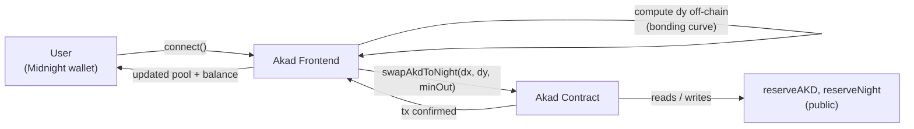
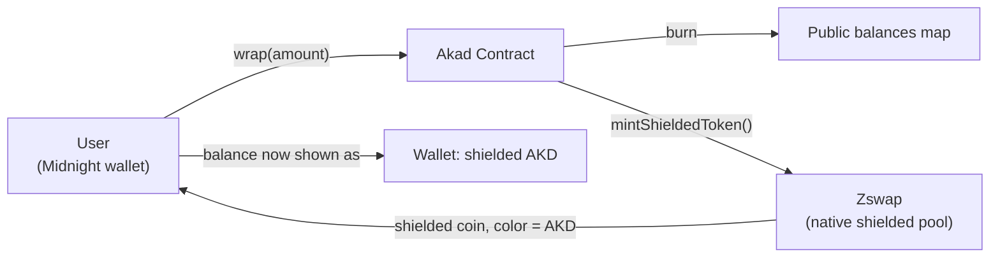
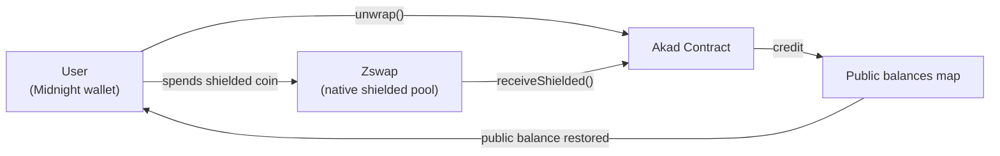
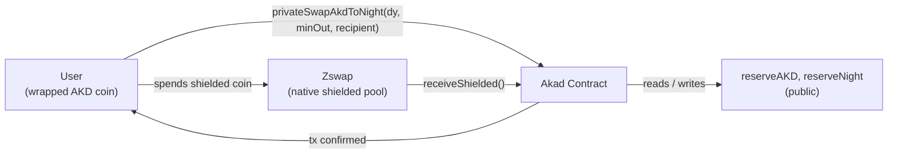

<div align="center">


# Akad


[](https://github.com/dzakwannajmi/akad/actions/workflows/ci.yml)
[](LICENSE)
[](https://x.com/akadtok)

Privacy-optional AMM on Midnight Network, submitted to the Midnight Korea Hackathon 2026

[Live Demo](https://akad-dzakwannajmis-projects.vercel.app) · [Demo Video](https://youtu.be/NAkaJpubq-U) · [@akadtok](https://x.com/akadtok) · [See Full Proposal](docs/PROPOSAL.md) · [Feedback & Testing](docs/FEEDBACK.md) · [Troubleshooting & Build Notes](docs/TROUBLESHOOTING.md)

</div>

> **Reviewing this for the hackathon?** Everything you need is in [`hackathon/`](hackathon/), written for someone seeing the project for the first time: [ARCHITECTURE.md](hackathon/ARCHITECTURE.md) for the contract, [MIDNIGHT_IMPLEMENTATION.md](hackathon/MIDNIGHT_IMPLEMENTATION.md) for exactly what is proven, disclosed, and kept private, [SECURITY_AUDIT.md](hackathon/SECURITY_AUDIT.md) for an independent adversarial audit of this contract (findings and all), and [HOW_TO_RUN.md](hackathon/HOW_TO_RUN.md) to compile it yourself in about five minutes.

<div align="center">

</div>

---

## Table of Contents

- [What is Akad](#what-is-akad)
- [Live Demo & Deployed Contracts](#live-demo--deployed-contracts)
- [Trying the App](#trying-the-app)
- [Network Toggle](#network-toggle)
- [Architecture](#architecture)
- [Design Notes](#design-notes)
- [End-to-End Flows](#end-to-end-flows)
- [Privacy Model](#privacy-model)
- [Roadmap](#roadmap)
- [Traction & User Validation](#traction--user-validation)
- [Testing & CI](#testing--ci)
- [Running Locally](#running-locally)
- [Project Structure](#project-structure)
- [License](#license)

## What is Akad

Akad is a constant-product AMM (`x * y = k`) for swapping a custom fungible token (AKD) against NIGHT on Midnight Network. Users can hold AKD publicly (standard token balance) or convert it into a shielded balance backed by Midnight's native Zswap infrastructure, which removes the public ledger row tying that holding to their wallet. See [Privacy Model](#privacy-model) for exactly what that does and does not hide.

The idea behind the name: "Akad" is an agreement between two parties — every swap is exactly that, with a level of openness each trader chooses for themselves.

## Live Demo & Deployed Contracts

**App:** https://akad-dzakwannajmis-projects.vercel.app/

**Network:** Midnight Preview testnet (default), with **Preprod** also live and verified — see [Network Toggle](#network-toggle) below.

**Contracts:** post-audit build (constructor replacing `init()`, real tNIGHT settlement on every swap circuit, `recordTokenColor()`).

| Contract | Network | Address |
|---|---|---|
| Akad (token + AMM) | Preview | `b889ee2cce94c04a1cfc5b4a0aea844d5167759381db11ac2cd87e93550ed53c` |
| Akad (token + AMM) | Preprod | `77e840accabf8b7f6301d55285218f93466e6a41c9623cb48d7529e7549eb4aa` |

[View the Preview contract on Night Scan](https://explorer.preview.midnight.network/contracts/stream/b889ee2cce94c04a1cfc5b4a0aea844d5167759381db11ac2cd87e93550ed53c)

Token and swap logic were originally two separate contracts, merged into one so swap circuits could move a trader's real AKD balance without relying on an unverified cross-contract authorization pattern. See [contracts/README.md](contracts/README.md) for why. Coins wrapped against an older deployment cannot be unwrapped against this one: every contract change regenerates the verifier key and the shielded token colour.

## Verified transactions

Every circuit exercised on both networks, against the addresses above. **Check these on the explorer rather than taking the table's word for it**, and look at three fields: `STATUS`, `EXECUTION SEGMENTS` (any `FAILED` segment means the effects were rolled back) and `SPENT INPUTS` (an unshielded token movement showing zero spent inputs never moved anything). All rows below are `SUCCESS` with no failed segments.

**Preprod**

| Action | Transaction |
|---|---|
| `deploy` | [`56e66bbe…70517f`](https://explorer.1am.xyz/tx/56e66bbef70ac96bc0fdbf84a2a9ccce553292673d071c06b7a2f0a5f970517f?network=preprod) |
| `recordTokenColor()` | [`c14c5d12…59bb83`](https://explorer.1am.xyz/tx/c14c5d129f860de203b7ada9433eb1861f43d07bed1ec05b5b75da58aa59bb83?network=preprod) |
| `addLiquidity()` | [`2ce051c7…3b7a65`](https://explorer.1am.xyz/tx/2ce051c7dd28eb2a8a5c1cbee27a13d1f8c76707a0110a8b26b0f76f0c3b7a65?network=preprod) |
| `transfer()` | [`e81a703e…8c07fc`](https://explorer.1am.xyz/tx/e81a703e23df9194df4b4f01f895570ec16e09a5a43c2126d9fecc27c38c07fc?network=preprod) |
| `wrap()` | [`55056f60…5550d4`](https://explorer.1am.xyz/tx/55056f60446cd60254b1e4d768ffb355f21249081fe9bc9b86cbb1017a5550d4?network=preprod) |
| `unwrap()` | [`01b4a7f8…5be3b6`](https://explorer.1am.xyz/tx/01b4a7f823bb68fed43b237d359fd24554548023e4ac54405f30a6a8555be3b6?network=preprod) |
| `swapAkdToNight()` | [`13529ea5…09576d`](https://explorer.1am.xyz/tx/13529ea5eb1b02ef99aae7b052b679e3584d93e3c6667c74017b2b596209576d?network=preprod) |
| `swapNightToAkd()` | [`6c98cf0f…c1a84b`](https://explorer.1am.xyz/tx/6c98cf0f8bf84750ece091c1be2f3c6b639f5979176579597d0451d295c1a84b?network=preprod) |
| `privateSwapAkdToNight()` | [`748c8447…afe8bd`](https://explorer.1am.xyz/tx/748c844738842528aeb36af90bcce7fd7da0119a30c16bcfd69b759fcdafe8bd?network=preprod) |
| `privateSwapNightToAkd()` | [`2e0f4c0a…1b3932`](https://explorer.1am.xyz/tx/2e0f4c0a2ba3f882a864ae9a0e3674c8b4d1892ba4f27ef3e743d16f3c1b3932?network=preprod) |

**Preview**

| Action | Transaction |
|---|---|
| `deploy` | [`8fd36439…30ad34`](https://explorer.1am.xyz/tx/8fd364392e4ca74a4c45818a46f2cba7bed3af16c29c01475f09da716a30ad34?network=preview) |
| `recordTokenColor()` | [`89d8c1cd…76b3a9`](https://explorer.1am.xyz/tx/89d8c1cdd8258551b1a274ab153153fe812e7547fad77019696a125cd176b3a9?network=preview) |
| `addLiquidity()` | [`bebc09ec…a375c6`](https://explorer.1am.xyz/tx/bebc09ec3a20b6ee33387a74c7e9b70b61b4012d4bd8245abd0e58a9fca375c6?network=preview) |
| `transfer()` | [`3fe489a1…85924f`](https://explorer.1am.xyz/tx/3fe489a1f071e950574503fef4f01fa1a9b88ec1f6579f72b18889a32e85924f?network=preview) |
| `wrap()` | [`648317af…24e3d5`](https://explorer.1am.xyz/tx/648317af1021ac6dedf90f71e1d4dff7536e978e6e753fe22bb37e406c24e3d5?network=preview) |
| `unwrap()` | [`8ada61f4…209ef6`](https://explorer.1am.xyz/tx/8ada61f4f4e68ce4d9df447585e248f940aa336e15463e5f02873e586f209ef6?network=preview) |
| `swapAkdToNight()` | [`5307741a…2ecadf`](https://explorer.1am.xyz/tx/5307741afc43d3206a295d557c4db9e7b80d55d5ae9127b1db0cd3d6ad2ecadf?network=preview) |
| `swapNightToAkd()` | [`bc690221…fc366e`](https://explorer.1am.xyz/tx/bc69022105bdb7bb5ac31c7208fc18ef8fe663fd316411d7ee8cef5935fc366e?network=preview) |
| `privateSwapAkdToNight()` | [`17824952…55fb1e`](https://explorer.1am.xyz/tx/17824952943bd80a502d478f32a1a044d06836c81fff0dcb949082c61855fb1e?network=preview) |
| `privateSwapNightToAkd()` | [`efa7d434…fb2dfe`](https://explorer.1am.xyz/tx/efa7d4349f0cb5d739c57ea8933d6a17761553d895de5ca494dd13a42ffb2dfe?network=preview) |

Two circuits have no row yet: `claimFaucet()` and `akdColor()`. Both are exercised in the app, neither has a published hash against these deployments.

Worth reading alongside the table: `addLiquidity()` and `privateSwapNightToAkd()` both show `SPENT INPUTS: 1`, which is real tNIGHT entering the contract through `receiveUnshielded`, and `privateSwapAkdToNight()` shows `PUBLIC OUTPUTS: 1` with zero spent inputs, which is real tNIGHT leaving the pool's own custody through `sendUnshielded`. Those three numbers are what distinguish real settlement from a ledger figure nobody backs, and they are the evidence that the two fund-loss findings in [hackathon/SECURITY_AUDIT.md](hackathon/SECURITY_AUDIT.md) are closed.

Earlier deployments are superseded and their hashes no longer describe this code. They are omitted rather than listed, since a hash that proves nothing about the current contract is worse than no hash at all.

## Trying the App

1. Install a Midnight wallet — **1AM** (recommended) or [Lace](https://www.lace.io/midnight) — and switch its network to **Preview**.
2. Get test tokens from the [Preview faucet](https://faucet.preview.midnight.network/): NIGHT for gas, and DUST generated from it.
3. Open the [live demo](https://akad-dzakwannajmis-projects.vercel.app/) and click **Launch App**.
4. Connect your wallet on the swap page.
5. Enter an amount, review the quote, and swap.
6. Try **Wrap to Private** below the swap card — wrap an AKD amount, then check your wallet: the shielded AKD appears as a native shielded token, unlinked from your public balance.
7. Unwrap sends it back the other way, crediting your public balance again.
8. Once you have a wrapped coin, flip **Private** in the swap card's settings to spend or receive the AKD leg directly as a shielded coin, skipping the wrap/unwrap round trip. See [Design Notes](#design-notes) for exactly what that hides and what it doesn't.

> **Wallet note:** `unwrap()` is verified on 1AM. On Lace, the shielded-receive transaction hangs inside the wallet's own `balanceUnsealedTransaction` and never returns — use 1AM for the full round trip.

## Network Toggle

Akad can run against **Preview** or **Preprod** from the same deployed site — a toggle switches the active network (indexer endpoints, wallet `connect()` target, and contract address) without editing env vars or redeploying. Preview is the default; Preprod now also has a deployed contract, with a full swap/wrap/unwrap cycle verified on it. See [`docs/TROUBLESHOOTING.md`](docs/TROUBLESHOOTING.md#network-preview-vs-preprod) for why Preprod was avoided early on and what's changed since, and `frontend/.env.example` for the full list of per-network env vars.

## Architecture

    contracts/    Compact smart contract (akad.compact: token + AMM), see contracts/README.md
    frontend/     Next.js app (landing, swap UI, wallet integration) — see frontend/README.md
    docs/         Build notes and troubleshooting log

**Stack:** Compact (smart contracts) · Next.js + TypeScript (frontend) · 1AM and Lace wallets via DApp Connector API v4 · shadcn/ui · Vitest · GitHub Actions.

## Design Notes

Akad's swap mechanics use a standard constant-product model — public reserves, `x * y = k`, no oracle dependency. This part is deliberately conventional: it's a well-understood, battle-tested AMM design, and reinventing pricing mechanics wasn't the point of this project.

The part that isn't standard is the privacy layer sitting alongside it. Rather than treating privacy as a separate product, Akad treats it as a mode a user opts into for their own holdings — public AKD behaves exactly like a normal ERC20-style balance, and `wrap` converts it into a native Zswap shielded coin whenever a user wants that balance to stop being publicly linkable. The AMM itself stays fully public (reserves have to be, for price discovery to work at all); the privacy boundary is drawn around token *custody*, not around the trade mechanism. See [Privacy Model](#privacy-model) for exactly what that boundary does and doesn't cover.

Private swap builds on that same boundary rather than adding a new one: `privateSwapAkdToNight` and `privateSwapNightToAkd` let a trader spend or receive the AKD leg of a trade as a shielded Zswap coin in the same transaction as the swap itself, instead of wrapping first, swapping publicly, then unwrapping. The AMM's public reserves and pricing don't change; only which ledger structure the trader's own AKD balance touches differs — a public map entry keyed to their address, versus a shielded coin nobody but the holder can link to a wallet.

**Where the AMM's settlement stands:** both legs are real, in all four swap circuits. The AKD leg moves a real balance between the trader (or the builder, for `addLiquidity`) and the pool's own custody account inside the contract. The tNIGHT leg uses Compact's unshielded-token primitives (`sendUnshielded` / `receiveUnshielded`, with `nativeToken()` as the color) so real tNIGHT moves in and out of the pool's on-chain custody, and `swapAkdToNight` checks `unshieldedBalanceGte` before promising a payout it cannot make.

The two private swap circuits used to be the exception: their tNIGHT leg was left out entirely, on the reasoning that `sendUnshielded`/`receiveUnshielded` are transparent and would reveal who traded with the pool. The reasoning about transparency was right, but the conclusion was wrong, and the audit is blunt about why: a circuit that moves real AKD in one direction and nothing in the other is not a privacy tradeoff, it is `privateSwapAkdToNight` taking a trader's AKD and paying nothing back, and `privateSwapNightToAkd` minting real AKD to anyone who asks. Both now settle tNIGHT for real, at the cost of a transparent tNIGHT leg on the private path.

A tNIGHT leg that is both real *and* private would need a genuinely shielded representation of the native token, which a contract cannot create: minting only works for a color the contract itself owns. That remains an open research question, not something solved here.

## End-to-End Flows

### Public Swap


```mermaid
flowchart LR
  U["User<br/>(Midnight wallet)"] -->|"connect()"| FE["Akad Frontend"]
  FE -->|"compute dy off-chain<br/>(bonding curve)"| FE
  FE -->|"swapAkdToNight(dx, dy, minOut)"| SC["Akad Contract"]
  SC -->|"reads / writes"| R["reserveAKD, reserveNight<br/>(public)"]
  SC -->|"tx confirmed"| FE
  FE -->|"updated pool + balance"| U
```

### Wrap — Public AKD to Private Shielded AKD


```mermaid
flowchart LR
  U["User<br/>(Midnight wallet)"] -->|"wrap(amount)"| TC["Akad Contract"]
  TC -->|"burn"| PB["Public balances map"]
  TC -->|"mintShieldedToken()"| ZS["Zswap<br/>(native shielded pool)"]
  ZS -->|"shielded coin, color = AKD"| U
  U -->|"balance now shown as"| L["Wallet: shielded AKD"]
```

### Unwrap — Private Shielded AKD back to Public AKD


```mermaid
flowchart LR
  U["User<br/>(Midnight wallet)"] -->|"unwrap()"| TC["Akad Contract"]
  U -->|"spends shielded coin"| ZS["Zswap<br/>(native shielded pool)"]
  ZS -->|"receiveShielded()"| TC
  TC -->|"credit"| PB["Public balances map"]
  PB -->|"public balance restored"| U
```

Both directions are verified on Preview — see the transaction table under [Live Demo & Deployed Contracts](#live-demo--deployed-contracts). `unwrap` requires the wallet to spend a shielded coin it owns; 1AM handles this, while Lace hangs inside its own transaction balancing.

### Private Swap — AKD leg spent or received as a shielded coin, in one transaction


```mermaid
flowchart LR
  U["User<br/>(wrapped AKD coin)"] -->|"privateSwapAkdToNight(dy, minOut, recipient)"| TC["Akad Contract"]
  U -->|"spends shielded coin"| ZS["Zswap<br/>(native shielded pool)"]
  ZS -->|"receiveShielded()"| TC
  TC -->|"reads / writes"| R["reserveAKD, reserveNight<br/>(public)"]
  TC -->|"tx confirmed"| U
```


```mermaid
flowchart LR
  U["User"] -->|"privateSwapNightToAkd(dx, dy, minOut)"| TC["Akad Contract"]
  TC -->|"reads / writes"| R["reserveAKD, reserveNight<br/>(public)"]
  TC -->|"mintShieldedToken()"| ZS["Zswap<br/>(native shielded pool)"]
  ZS -->|"shielded coin, color = AKD"| U
```

Both circuits assert the spent or minted coin's color matches AKD's own shielded color before moving it — the same check `unwrap()` was missing until this release (see [Roadmap](#roadmap)). Verified on Preview; see the transaction table above.

## Privacy Model

Every claim in this section was checked against live transactions on Preprod, not against platform documentation. That distinction is not pedantry: an earlier version of this section, and the security audit backing it, both asserted a leak that turned out not to exist, purely because nobody had opened a transaction to look. The correction is written up in [hackathon/SECURITY_AUDIT.md](hackathon/SECURITY_AUDIT.md) under "H-02 refuted on chain".

What an observer **can** learn from public state:

- Pool reserves at any moment, and every individual swap's size and direction. Reserve deltas are public because a constant-product AMM cannot price trades without them. True on any chain.
- Public AKD balances, keyed by the holder's Zswap coin public key. The key is the wallet's real identifier, not a hash of it.
- The circuit you called and the contract you called it on. A block explorer labels the transaction "Wrap" or "Private swap akd to night" outright.
- **Your unshielded NIGHT address and the NIGHT amount, on either private swap.** This is the real privacy limit of this project. `sendUnshielded` and `receiveUnshielded` are transparent by design, so both private circuits name you:

  ```
  privateSwapAkdToNight   created output   mn_addr_prepro…9xrqm0l9eh    20.15355 NIGHT
  privateSwapNightToAkd   spent input      mn_addr_prepro…9xrqm0l9eh     1,807 NIGHT
                          created output   mn_addr_prepro…9xrqm0l9eh     1,786 NIGHT
  ```

  The same address in both, so the two trades are linkable to each other and to one wallet, with no decoding required.

What an observer **cannot** learn:

- **What you hold, while you hold it wrapped.** `wrap` burns a public balance and mints a native Zswap shielded coin to the caller, so there is no ledger row tying that balance to your address for as long as it stays shielded. `unwrap` reverses it. Verified on Preprod: both transactions carry zero public outputs, zero spent inputs, and no address of any kind.
- **Which coin you spent.** Coin nonces and spent coins come from `witness` functions, so they are not public inputs to the proof. `unwrap()` takes no arguments at all and its proof has zero public inputs. Circuit arguments are not serialised in plaintext into a transaction either, which was tested directly rather than assumed.
- The contents of the shielded pool itself, which is Midnight's own audited cryptography rather than a hand-rolled commitment scheme.

The honest boundary, stated once: **Akad gives you privacy of custody, not privacy of the trade, and not anonymity while trading.** Holding AKD in shielded form genuinely removes your standing public row, and that part works. The moment you trade through either private circuit, the NIGHT leg publishes your address. Trade amounts are public regardless, because reserve deltas expose them. What wrapping buys you is real and worth having; it is not a cloak, and this README will not sell it as one.

All four coin-handling circuits (`wrap`, `unwrap`, `privateSwapAkdToNight`, `privateSwapNightToAkd`) assert the coin's color matches AKD's own shielded color before moving it, so shielded supply stays 1:1 backed by locked public balance and cannot be inflated by feeding in a different token's shielded coin.

Every public-input count above is reproducible from a clean clone: compile the contract, then run `node scripts/zk-public-inputs.mjs`. The full reasoning, including a finding this audit filed as High and later disproved on chain, is in [hackathon/SECURITY_AUDIT.md](hackathon/SECURITY_AUDIT.md).

## Roadmap

- [x] Real NIGHT settlement in **all four** swap circuits: `sendUnshielded`/`receiveUnshielded` are wired into `addLiquidity`, `swapAkdToNight`, `swapNightToAkd`, `privateSwapAkdToNight` and `privateSwapNightToAkd`. Verified on-chain on **both** networks against the post-audit contract, with one hash per circuit in the table above. Making the private path's tNIGHT leg both real *and* private remains a separate, still-open research item: it needs a shielded representation of the native token, which a contract cannot mint.
- [x] Private swap: spend or receive a shielded AKD coin directly in a swap, rather than wrap, then public swap, then unwrap. Both directions shipped and verified on both networks.
- [ ] Multi-token support — pools beyond AKD/NIGHT
- [ ] Full Lace support — `unwrap` currently requires 1AM; Lace's transaction balancing hangs on shielded receive
- [ ] Multi-chain — beyond Midnight
- [ ] Mobile-responsive UI
- [ ] Multi-provider liquidity (LP tokens) — currently a single fixed liquidity seed from the builder
- [ ] Pool page — a dedicated page for the AKD/NIGHT pool itself (live reserves, a price chart, TVL, and volume), the way a standard DEX shows its pool view, instead of the single reserve line on the swap card today
- [ ] Address the unshielded address exposure on the private swap path. Both private circuits publish the trader's unshielded NIGHT address in the clear, because `sendUnshielded` and `receiveUnshielded` are transparent by design. This is the project's real privacy limit and no wording change removes it. Solving it properly needs a shielded representation of the native token, which a contract cannot mint; the interim options are to constrain the private path to one direction, or to surface the exposure in the UI beside the private toggle so no user mistakes it for anonymity
- [ ] Reserve-delta privacy research: batching or delayed settlement to reduce what is inferable from public reserve changes
- [x] Deploy the contract to Preprod and verify a full swap/wrap/unwrap cycle there
- [ ] Akad Explorer — a self-built block/transaction explorer scoped to the Akad contract, instead of relying on Night Scan/1AM's explorer for a full picture of pool and wallet activity
- [ ] Akad as a wallet — extend the swap app itself into a lightweight Midnight wallet (key management, balances, shielded coins) instead of only connecting to an external one
- [ ] Akad SDK — a published TypeScript package wrapping the contract's circuits and providers, so other developers can integrate Akad swap/wrap/unwrap into their own dApps without copying `lib/akad-api.ts`

## Traction & User Validation

Real testers used the live app on Midnight Preprod, then reported back through a public form that
asks for their wallet address and a transaction hash from their own session. That makes the
feedback loop checkable rather than asserted.

**70 responses. 70 unique wallets. 70 transaction hashes, all verified on chain. Average rating
4.4 out of 5.**

Every hash was queried against the public Preprod indexer. All 70 resolve, all 70 settled with
status `SUCCESS`, and every one calls an Akad circuit on one of the two deployed Preprod
contracts. Where a circuit publishes an unshielded address, the claimed wallet was compared
against the on-chain counterparty: 15 rows could be checked that way and 15 matched. The rest
call circuits that publish no address at all, which is the privacy property this contract exists
for, and that limitation is stated in the user lists rather than glossed over.

### Users

[`USERS.md`](USERS.md) lists the first **50 wallets**, with the date, the features each tester
tried, a link to their transaction, and its on-chain check. It also documents the verification
method, including the exact GraphQL query, so the whole table can be re-verified independently.

### Launch users

[`LAUNCH_USERS.md`](LAUNCH_USERS.md) lists a further **20 wallets** from the launch session, none
of which appears in `USERS.md`. The split follows a real gap in the data rather than an arbitrary
cut: the first cohort finished at 13:00 and the launch session began at 16:53, visible in both
the form timestamps and the block heights.

### What testers asked for, and what changed because of it

[`docs/FEEDBACK.md`](docs/FEEDBACK.md) carries the verbatim feedback grouped by theme, and a
"What We Changed" section where every item names the commit or the transaction hash behind it.
The largest theme was that people could not tell what the private swap actually did. Chasing that
down revealed the circuits were not settling the NIGHT leg at all, which led to the real
settlement fix and then to the shielded sNIGHT pairing. That section also lists what is still
open, including in-app transaction status, tooltips, and fee information.

The project has 58 commits on `main`. The feedback-driven changes are named by commit message in
`docs/FEEDBACK.md`, and the full history is on
[GitHub](https://github.com/dzakwannajmi/akad/commits/main).

## Testing & CI

8+ tests (Vitest) covering bonding curve math and wallet compatibility filtering — see `frontend/lib/__tests__/`.

GitHub Actions runs typecheck, tests, and build on every push — see `.github/workflows/ci.yml`.

## Running Locally

Contracts:

    cd contracts
    compact compile src/akad.compact ../build/akad

Frontend:

    cd frontend
    npm install
    cp .env.example .env.local
    npm run dev

Full details, including artifact wiring and environment variables, in [contracts/README.md](contracts/README.md) and [frontend/README.md](frontend/README.md).

## Project Structure

See [Architecture](#architecture) above, or the per-folder READMEs for details.

## License

MIT — see [LICENSE](LICENSE).
