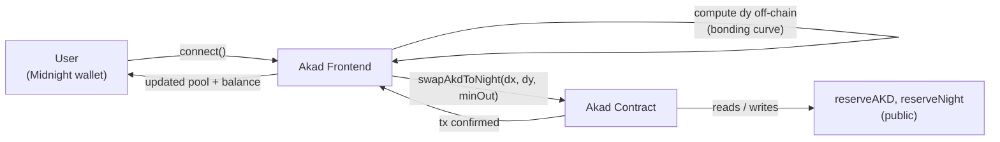
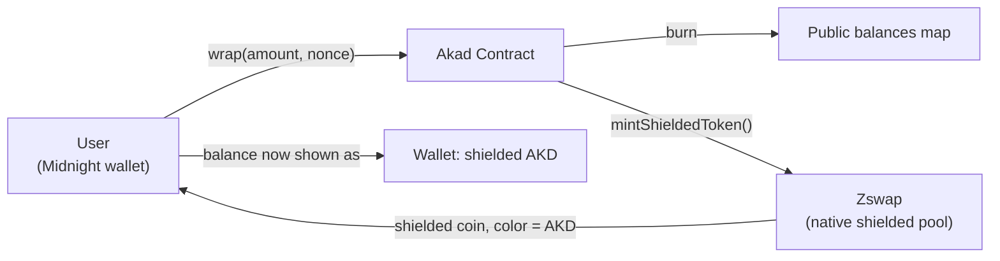
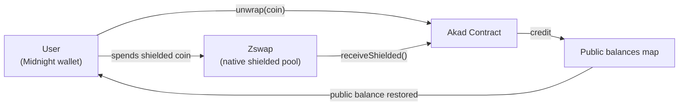
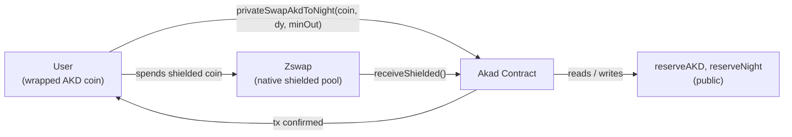
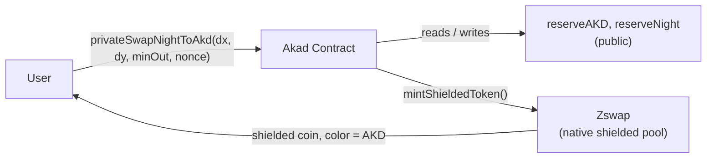

# Akad

Privacy-optional AMM on Midnight Network, built for Rise In × Midnight "New Moon to Full: Monthly Moonshots"

[Live Demo](https://akad-dzakwannajmis-projects.vercel.app) · [Demo Video](https://youtu.be/NAkaJpubq-U) · [@akadtok](https://x.com/akadtok) · [See Full Proposal](docs/PROPOSAL.md) · [Feedback & Testing](docs/FEEDBACK.md) · [Troubleshooting & Build Notes](docs/TROUBLESHOOTING.md)

---

## Table of Contents

- [What is Akad](#what-is-akad)
- [Live Demo & Deployed Contracts](#live-demo--deployed-contracts)
- [Trying the App](#trying-the-app)
- [Network Toggle](#network-toggle)
- [Architecture](#architecture)
- [Design Notes](#design-notes)
- [End-to-End Flows](#end-to-end-flows)
- [Privacy Model](#privacy-model)
- [Roadmap](#roadmap)
- [Community Feedback](#community-feedback)
- [Testing & CI](#testing--ci)
- [Running Locally](#running-locally)
- [Project Structure](#project-structure)
- [License](#license)

## What is Akad

Akad is a constant-product AMM (`x * y = k`) for swapping a custom fungible token (AKD) against NIGHT on Midnight Network. Users can hold AKD publicly (standard token balance) or convert it into a genuinely private, unlinkable balance backed by Midnight's native Zswap shielded-coin infrastructure.

The idea behind the name: "Akad" is an agreement between two parties — every swap is exactly that, with a level of openness each trader chooses for themselves.

## Live Demo & Deployed Contracts

**App:** https://akad-dzakwannajmis-projects.vercel.app/

**Network:** Midnight Preview testnet (default), with **Preprod** also live and verified — see [Network Toggle](#network-toggle) below.

**Contracts:**

| Contract | Network | Address |
|---|---|---|
| Akad (token + AMM) | Preview | `2ec37a07a9bce3da3058bd45d4ddbc0f6bc392f2056aefe8d00b13013a0b8896` |
| Akad (token + AMM) | Preprod | `81182dd2e98bf62c4148a7c0b96d1154779a10093cf911706da5986ab067e1b7` |

[View Preview contract on Night Scan](https://explorer.preview.midnight.network/contracts/stream/2ec37a07a9bce3da3058bd45d4ddbc0f6bc392f2056aefe8d00b13013a0b8896)

Token and swap logic were originally two separate contracts; they were merged into one so swap circuits could move a trader's real AKD balance without relying on an unverified cross-contract authorization pattern. See [contracts/README.md](contracts/README.md) for why. Both addresses above are from the redeploy that wired real tNIGHT settlement into `addLiquidity`/`swapAkdToNight`/`swapNightToAkd` via `sendUnshielded`/`receiveUnshielded` (see [Design Notes](#design-notes)) — `swapAkdToNight` also gained a new `recipient: UserAddress` parameter, which is itself an interface change that forces a fresh deployment. Coins wrapped against an older deployment cannot be unwrapped against this one.

**Verified transactions**, on-chain, on the contract addresses above, one of each circuit on each network:

Preview: pending re-verification on the redeployed contract above (`2ec37a07…`). The six hashes previously listed here (one per circuit) are real, but they were run against the superseded Preview deployment, not this one -- listed under "Previous deployment" below instead of implying they prove anything about the current address.

Preprod:

| Action | Transaction |
|---|---|
| `swapAkdToNight()` | [`1a288d1c…12fc`](https://explorer.1am.xyz/tx/1a288d1c8f258611b117c9bef02945f6d04789a3cb804d9964121a4bb5e612fc?network=preprod) -- real tNIGHT paid out of pool custody via `sendUnshielded` |
| `swapNightToAkd()` | [`30f614c8…6e07a`](https://explorer.1am.xyz/tx/30f614c88dd46e903c3b8626e24a745d3a17c9ecd645423cfc8f935750d6e07a?network=preprod) -- real tNIGHT pulled from the trader into pool custody via `receiveUnshielded` |
| `wrap()` | pending re-verification on this redeployed contract |
| `unwrap()` | pending re-verification on this redeployed contract |
| `privateSwapAkdToNight()` | pending re-verification on this redeployed contract |
| `privateSwapNightToAkd()` | pending re-verification on this redeployed contract |

Previous deployments (superseded, kept for history): Preview `462616f6263725ab0a22b5ffdcde5798a47c39ec72f04978c2e0bb8b9588583f` then `69637ed3acebec446aab0a6b7029542ce9fdaf63eea275ff033783a069e59f40`; Preprod `52907ea70ae01643508a270cf5592901e8b88216f1d332e953231f788b7e7975` then `55f49f1cb90332976244a358be62a894d8370295f362254f630dd86025f6d9ce`. The six per-circuit hashes previously verified against the two most-recent superseded addresses (`69637ed3…` Preview, `55f49f1c…` Preprod) are: `swapAkdToNight` [`e8b715e8…b925cd3`](https://explorer.1am.xyz/tx/e8b715e872d63d0dc573a44c07ce2785f9b8a7d4c933efc9d62a3c8e1b925cd3?network=preview) (Preview) / [`62de96af…1a3bb76`](https://explorer.1am.xyz/tx/62de96afc9684d749ab206f832b39175cb105c4190ec14d921de9e0f31a3bb76?network=preprod) (Preprod), `swapNightToAkd` [`ab12661d…0b15bf9`](https://explorer.1am.xyz/tx/ab12661d560a7ea0ab76e4b9ccb071fb13cc2937551ed083973f095070b15bf9?network=preview) (Preview) / [`341a8361…18b3691`](https://explorer.1am.xyz/tx/341a8361fb1560aea1b4a9bf2d0f92474c690df009324987110c1fdbd18b3691?network=preprod) (Preprod), `wrap` [`e0afe019…698ca3a`](https://explorer.1am.xyz/tx/e0afe0195ea8bdb1ea44640aeba2a0faaf09210f0bfee824856887296698ca3a?network=preview) (Preview) / [`a3eaca37…6d7c8b3`](https://explorer.1am.xyz/tx/a3eaca376205800047ab8d86afcbc2132d5797c1b2d12e854ff426a906d7c8b3?network=preprod) (Preprod), `unwrap` [`27b02bf2…5c0b59f`](https://explorer.1am.xyz/tx/27b02bf2085f88ebc22cc08e007e305bf550eaf6ec9ce3c1513b904e25c0b59f?network=preview) (Preview) / [`a63ee30c…fbdd22d`](https://explorer.1am.xyz/tx/a63ee30c2ad941cb688df6d15c8be5725cd8a55b89159f0bbe2fc165cfbdd22d?network=preprod) (Preprod), `privateSwapAkdToNight` [`0ea5d06d…4310bba`](https://explorer.1am.xyz/tx/0ea5d06da7d3dd69a5f31ddddac9b817a7941dde45836452304cc3b804310bba?network=preview) (Preview) / [`3d0f4b58…d60dffd`](https://explorer.1am.xyz/tx/3d0f4b58c26ed5491ceacf5284ce097e31e29e01d2e57d387b6d62b56d60dffd?network=preprod) (Preprod), `privateSwapNightToAkd` [`d60c058d…9ed33ba`](https://explorer.1am.xyz/tx/d60c058d08d19492989214d0c4b9d5dc6951fc01b4e6ffedd3fcb6da49ed33ba?network=preview) (Preview) / [`9b06237a…e54bac0`](https://explorer.1am.xyz/tx/9b06237aa80ccbe28dfd3b99c4d1e41513633ebebb09e3fbdbd900495e54bac0?network=preprod) (Preprod).

## Trying the App

1. Install a Midnight wallet — **1AM** (recommended) or [Lace](https://www.lace.io/midnight) — and switch its network to **Preview**.
2. Get test tokens from the [Preview faucet](https://faucet.preview.midnight.network/): NIGHT for gas, and DUST generated from it.
3. Open the [live demo](https://akad-dzakwannajmis-projects.vercel.app/) and click **Launch App**.
4. Connect your wallet on the swap page.
5. Enter an amount, review the quote, and swap.
6. Try **Wrap to Private** below the swap card — wrap an AKD amount, then check your wallet: the shielded AKD appears as a native shielded token, unlinked from your public balance.
7. Unwrap sends it back the other way, crediting your public balance again.
8. Once you have a wrapped coin, flip **Private** in the swap card's settings to spend or receive the AKD leg directly as a shielded coin, skipping the wrap/unwrap round trip. See [Design Notes](#design-notes) for exactly what that hides and what it doesn't.

> **Wallet note:** `unwrap()` is verified on 1AM. On Lace, the shielded-receive transaction hangs inside the wallet's own `balanceUnsealedTransaction` and never returns — use 1AM for the full round trip.

## Network Toggle

Akad can run against **Preview** or **Preprod** from the same deployed site — a toggle switches the active network (indexer endpoints, wallet `connect()` target, and contract address) without editing env vars or redeploying. Preview is the default; Preprod now also has a deployed contract, with a full swap/wrap/unwrap cycle verified on it. See [`docs/TROUBLESHOOTING.md`](docs/TROUBLESHOOTING.md#network-preview-vs-preprod) for why Preprod was avoided early on and what's changed since, and `frontend/.env.example` for the full list of per-network env vars.

## Architecture

    contracts/    Compact smart contract (akad.compact: token + AMM), see contracts/README.md
    frontend/     Next.js app (landing, swap UI, wallet integration) — see frontend/README.md
    docs/         Build notes and troubleshooting log

**Stack:** Compact (smart contracts) · Next.js + TypeScript (frontend) · 1AM and Lace wallets via DApp Connector API v4 · shadcn/ui · Vitest · GitHub Actions.

## Design Notes

Akad's swap mechanics use a standard constant-product model — public reserves, `x * y = k`, no oracle dependency. This part is deliberately conventional: it's a well-understood, battle-tested AMM design, and reinventing pricing mechanics wasn't the point of this project.

The part that isn't standard is the privacy layer sitting alongside it. Rather than treating privacy as a separate product, Akad treats it as a mode a user opts into for their own holdings — public AKD behaves exactly like a normal ERC20-style balance, and `wrap` converts it into a native Zswap shielded coin whenever a user wants that balance to stop being publicly linkable. The AMM itself stays fully public (reserves have to be, for price discovery to work at all); the privacy boundary is drawn around token *custody*, not around the trade mechanism. See [Privacy Model](#privacy-model) for exactly what that boundary does and doesn't cover.

Private swap builds on that same boundary rather than adding a new one: `privateSwapAkdToNight` and `privateSwapNightToAkd` let a trader spend or receive the AKD leg of a trade as a shielded Zswap coin in the same transaction as the swap itself, instead of wrapping first, swapping publicly, then unwrapping. The AMM's public reserves and pricing don't change; only which ledger structure the trader's own AKD balance touches differs — a public map entry keyed to their address, versus a shielded coin nobody but the holder can link to a wallet.

**Where the AMM's settlement currently stands:** the AKD leg of every swap and of the initial liquidity seed is a real balance transfer, moving AKD between the trader (or the builder, for `addLiquidity`) and the pool's own custody account inside the contract. The tNIGHT leg of the *public* swap circuits (`swapAkdToNight`, `swapNightToAkd`) and of `addLiquidity` is now written to be real too, using Compact's unshielded-token primitives (`sendUnshielded` / `receiveUnshielded` with `nativeToken()` as the color) so real tNIGHT moves in and out of the pool's own on-chain custody instead of `reserveNight` being a number nobody actually backs. This is implemented in source but not yet compiled, redeployed, and confirmed against a live transaction — treat it as pending verification, not shipped, until that happens (see [Roadmap](#roadmap)). The two *private* swap circuits are the one place tNIGHT settlement stays intentionally simulated: `sendUnshielded`/`receiveUnshielded` are transparent by design, so wiring them into a private swap would publicly reveal exactly who traded tNIGHT with this pool and for how much, defeating the reason to use the private path at all. A real and private tNIGHT leg would need a genuinely shielded representation of tNIGHT, which this contract has no way to create.

## End-to-End Flows

### Public Swap

```mermaid
flowchart LR
  U["User<br/>(Midnight wallet)"] -->|"connect()"| FE["Akad Frontend"]
  FE -->|"compute dy off-chain<br/>(bonding curve)"| FE
  FE -->|"swapAkdToNight(dx, dy, minOut)"| SC["Akad Contract"]
  SC -->|"reads / writes"| R["reserveAKD, reserveNight<br/>(public)"]
  SC -->|"tx confirmed"| FE
  FE -->|"updated pool + balance"| U
```

### Wrap — Public AKD to Private Shielded AKD

```mermaid
flowchart LR
  U["User<br/>(Midnight wallet)"] -->|"wrap(amount, nonce)"| TC["Akad Contract"]
  TC -->|"burn"| PB["Public balances map"]
  TC -->|"mintShieldedToken()"| ZS["Zswap<br/>(native shielded pool)"]
  ZS -->|"shielded coin, color = AKD"| U
  U -->|"balance now shown as"| L["Wallet: shielded AKD"]
```

### Unwrap — Private Shielded AKD back to Public AKD

```mermaid
flowchart LR
  U["User<br/>(Midnight wallet)"] -->|"unwrap(coin)"| TC["Akad Contract"]
  U -->|"spends shielded coin"| ZS["Zswap<br/>(native shielded pool)"]
  ZS -->|"receiveShielded()"| TC
  TC -->|"credit"| PB["Public balances map"]
  PB -->|"public balance restored"| U
```

Both directions are verified on Preview — see the transaction table under [Live Demo & Deployed Contracts](#live-demo--deployed-contracts). `unwrap` requires the wallet to spend a shielded coin it owns; 1AM handles this, while Lace hangs inside its own transaction balancing.

### Private Swap — AKD leg spent or received as a shielded coin, in one transaction

```mermaid
flowchart LR
  U["User<br/>(wrapped AKD coin)"] -->|"privateSwapAkdToNight(coin, dy, minOut)"| TC["Akad Contract"]
  U -->|"spends shielded coin"| ZS["Zswap<br/>(native shielded pool)"]
  ZS -->|"receiveShielded()"| TC
  TC -->|"reads / writes"| R["reserveAKD, reserveNight<br/>(public)"]
  TC -->|"tx confirmed"| U
```

```mermaid
flowchart LR
  U["User"] -->|"privateSwapNightToAkd(dx, dy, minOut, nonce)"| TC["Akad Contract"]
  TC -->|"reads / writes"| R["reserveAKD, reserveNight<br/>(public)"]
  TC -->|"mintShieldedToken()"| ZS["Zswap<br/>(native shielded pool)"]
  ZS -->|"shielded coin, color = AKD"| U
```

Both circuits assert the spent or minted coin's color matches AKD's own shielded color before moving it — the same check `unwrap()` was missing until this release (see [Roadmap](#roadmap)). Verified on Preview; see the transaction table above.

## Privacy Model

What an observer **can** learn from the public contract state:

- Pool reserves at any point in time, and every individual swap's size and direction (reserve deltas are public — required for AMM price discovery, true of any chain).
- Public AKD balances, keyed by a hashed (not plaintext) wallet identifier.

What an observer **cannot** learn:

- Slippage tolerance (`minOut`) — used only in an on-chain assertion, never written to public state. A value proven correct without ever being shown.
- **Ownership of any AKD balance held in shielded form.** `wrap` burns a public balance and mints a native Zswap shielded coin to the caller; `unwrap` returns that coin to the contract and credits the public balance back. `privateSwapAkdToNight` and `privateSwapNightToAkd` extend the same boundary directly into a swap, spending or receiving the AKD leg as a shielded coin without ever writing a balance keyed to the trader's address. While shielded, the AKD is unlinkable from the public balance it came from, using Midnight's own shielded-pool cryptography rather than a hand-rolled scheme.

All four circuits (`wrap`, `unwrap`, `privateSwapAkdToNight`, `privateSwapNightToAkd`) assert the coin's color matches AKD's own shielded color before moving it, so shielded supply stays 1:1 backed by locked public balance and can't be inflated by feeding in a different token's shielded coin.

The honest boundary: swap trade amounts remain public (structural to any public-reserve AMM); balance ownership is private while wrapped. Akad does not claim trade-amount privacy during a swap.

## Roadmap

- [x] Real NIGHT settlement: `sendUnshielded`/`receiveUnshielded` are wired into `addLiquidity`, `swapAkdToNight`, and `swapNightToAkd`, confirmed working on-chain on Preprod (see the verified-transactions table above -- both swap directions move real tNIGHT, not a simulated balance). Preview and the wrap/unwrap/private-swap circuits are pending re-verification against the redeployed contract, tracked in the same table. The private swap circuits keep tNIGHT simulated on purpose (see [Design Notes](#design-notes)); making that leg both real and private is a separate, still-open research item.
- [x] Private swap — spend or receive a shielded AKD coin directly in a swap, rather than wrap to public swap to unwrap. Shipped both directions (`privateSwapAkdToNight`, `privateSwapNightToAkd`), verified on Preview.
- [ ] Multi-token support — pools beyond AKD/NIGHT
- [ ] Full Lace support — `unwrap` currently requires 1AM; Lace's transaction balancing hangs on shielded receive
- [ ] Multi-chain — beyond Midnight
- [ ] Mobile-responsive UI
- [ ] Multi-provider liquidity (LP tokens) — currently a single fixed liquidity seed from the builder
- [ ] Pool page — a dedicated page for the AKD/NIGHT pool itself (live reserves, a price chart, TVL, and volume), the way a standard DEX shows its pool view, instead of the single reserve line on the swap card today
- [ ] Reserve-delta privacy research — batching or delayed settlement to reduce what's inferable from public reserve changes
- [x] Deploy the contract to Preprod and verify a full swap/wrap/unwrap cycle there
- [ ] Akad Explorer — a self-built block/transaction explorer scoped to the Akad contract, instead of relying on Night Scan/1AM's explorer for a full picture of pool and wallet activity
- [ ] Akad as a wallet — extend the swap app itself into a lightweight Midnight wallet (key management, balances, shielded coins) instead of only connecting to an external one
- [ ] Akad SDK — a published TypeScript package wrapping the contract's circuits and providers, so other developers can integrate Akad swap/wrap/unwrap into their own dApps without copying `lib/akad-api.ts`

## Community Feedback

Real testers try the live app, then report back through a short form, real wallet address and a transaction hash from their own session included, so the feedback loop is verifiable rather than just claimed. See [`docs/FEEDBACK.md`](docs/FEEDBACK.md) for the form, the live response spreadsheet, and the demo video walkthrough.

## Testing & CI

8+ tests (Vitest) covering bonding curve math and wallet compatibility filtering — see `frontend/lib/__tests__/`.

GitHub Actions runs typecheck, tests, and build on every push — see `.github/workflows/ci.yml`.

## Running Locally

Contracts:

    cd contracts
    compact compile src/akad.compact ../build/akad

Frontend:

    cd frontend
    npm install
    cp .env.example .env.local
    npm run dev

Full details, including artifact wiring and environment variables, in [contracts/README.md](contracts/README.md) and [frontend/README.md](frontend/README.md).

## Project Structure

See [Architecture](#architecture) above, or the per-folder READMEs for details.

## License

MIT — see [LICENSE](LICENSE).
